## Trabalho senac Software Livre Instalação Ubuntu Linux
Olá, começaremos agora um breve passo a passo sobre a instalação e configuração do Ubuntu 18.04.1 LTS.

Após baixar o Ubuntu, basta gravá-lo em um DVD usando o programa de sua preferência. Caso esteja utilizando o Windows 7 ou 8, esta etapa é mais simples: clique com o botão direito do mouse no arquivo e em seguida em "Gravar imagem".

Depois de gravar o Ubuntu em um DVD, reinicie a máquina e escolha a opção de realizar o boot pelo Ubuntu. Após iniciar, teremos duas opções:

Experimentar Ubuntu: roda o Ubuntu diretamente do DVD, ideal para quem quer experimentar o sistema sem realizar nenhuma modificação na máquina. A experiência é relativamente ruim, afinal há uma enorme perda de desempenho já que a velocidade do DVD é devagar, mesmo se comparado a um disco rígido convencional;
Instalar Ubuntu: inicia diretamente a instalação. Mesmo que o usuário escolha "Try Ubuntu", é possível iniciar a instalação por meio de um atalho no desktop.

## Primeiro, escolha a língua desejada (Português do Brasil) na lista do lado esquerdo e clique em “Instalar o Ubuntu”;

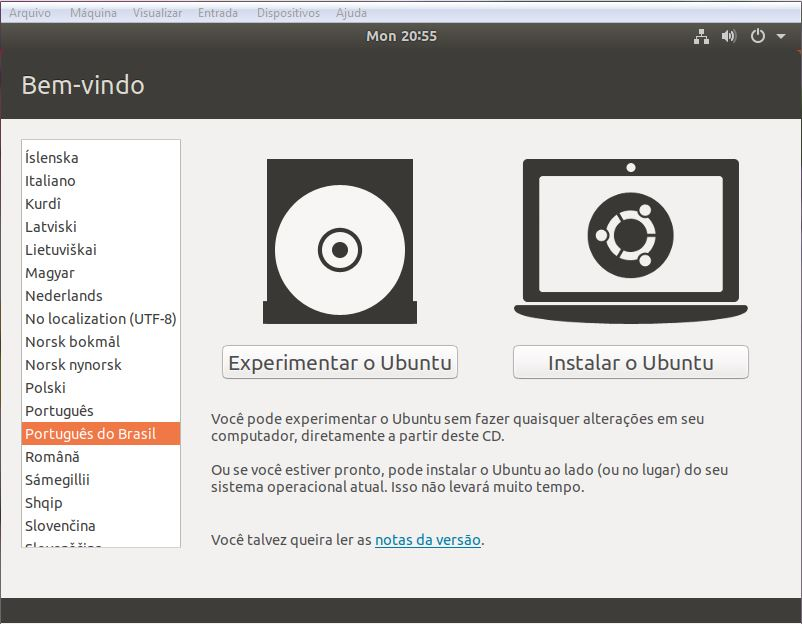

## Clique em "Continuar";

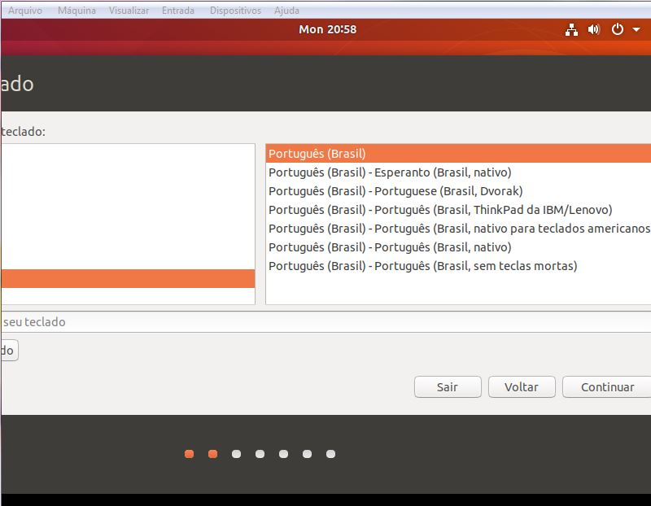

Aqui você pode optar por "instalação normal" ou "instalação mínima. Se você quer uma instalação rápida desaive a opção "Baixar atualizações equanto instala o ubuntu", caso não:
## Clique em Continuar;

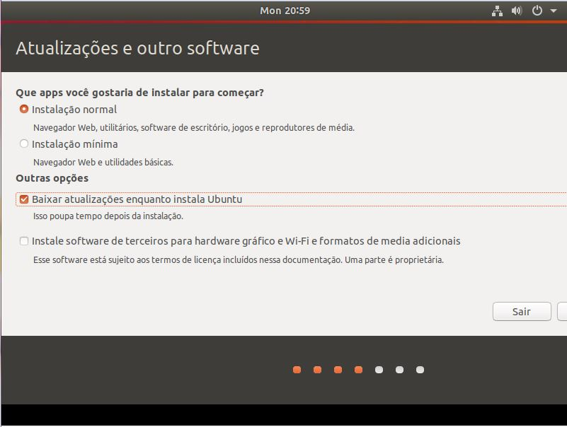

## Clique em "Continuar";

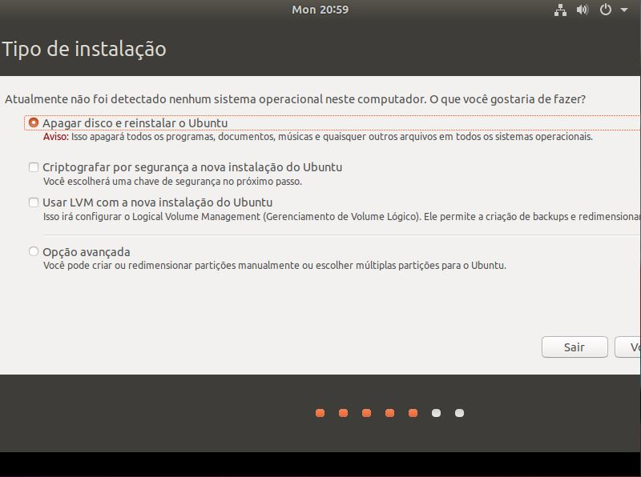

## Clique em "Continuar";

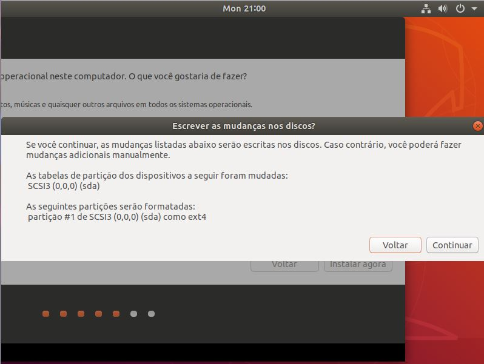

Caso não esteja localizado em sua região: selecione. E em seguida continuar.
## Clique em "Continuar";

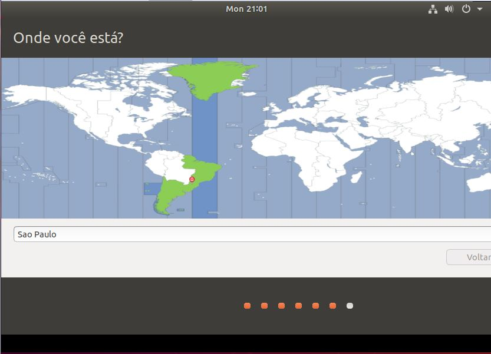
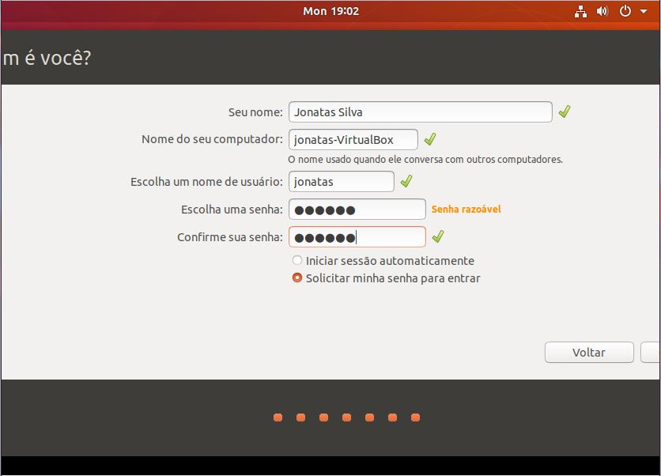
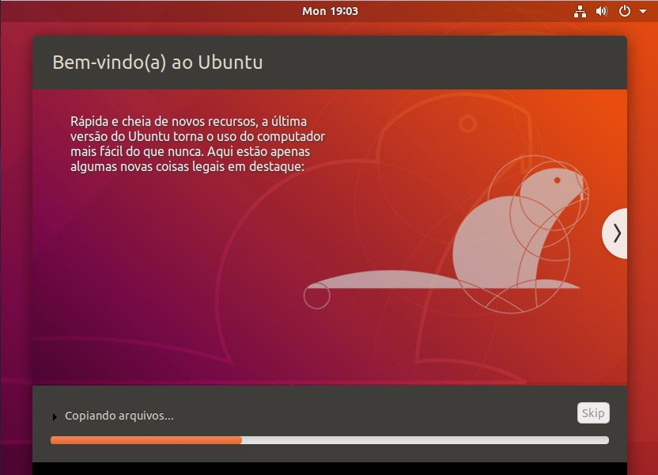
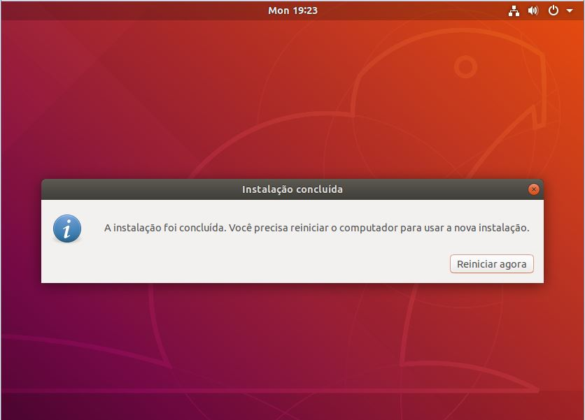
Após reiniciar sua máquina aparecerá a tela para você selecionar qual perfil utilizar:
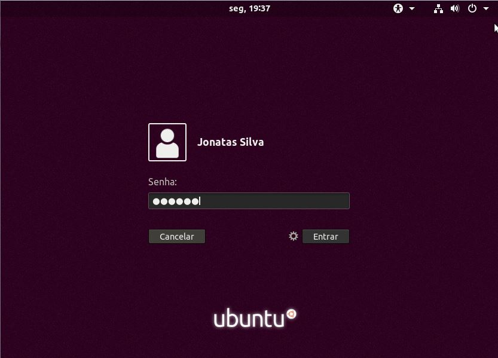
E finalmente... Está concluida a instalação.
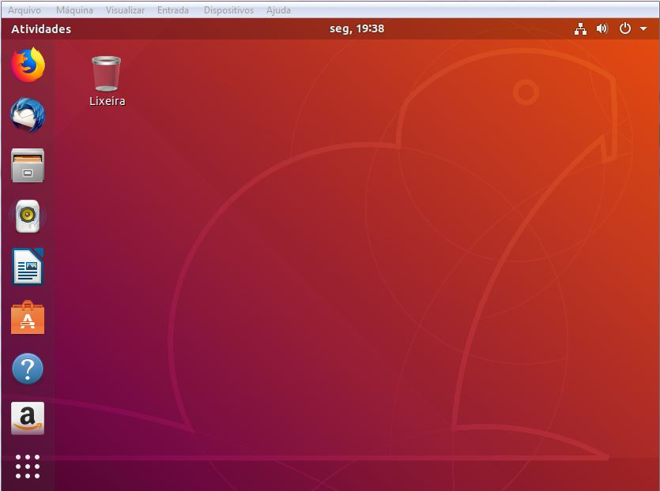
Pronto, sua instalação e configuração do Linux Ubuntu está finalizada. Agora é só utilizar.
